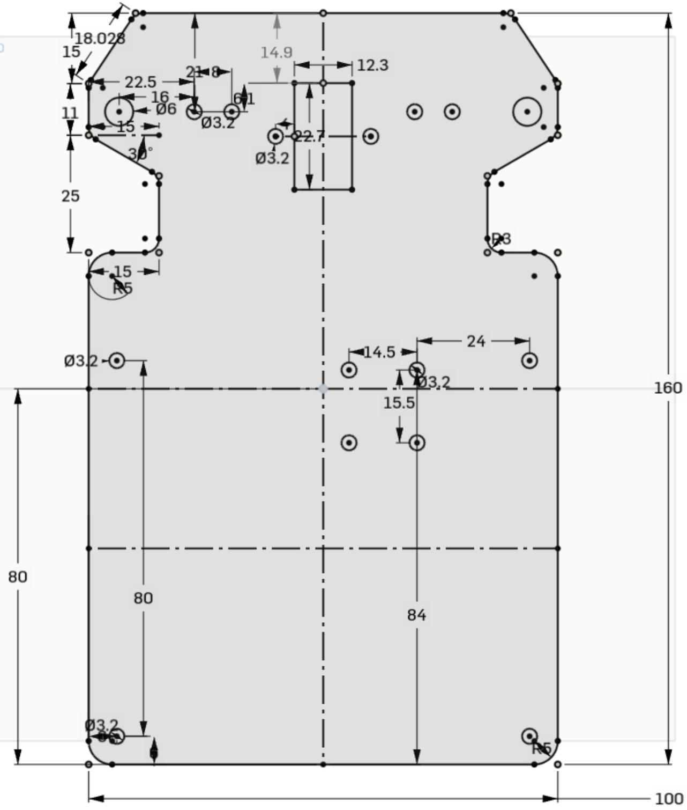
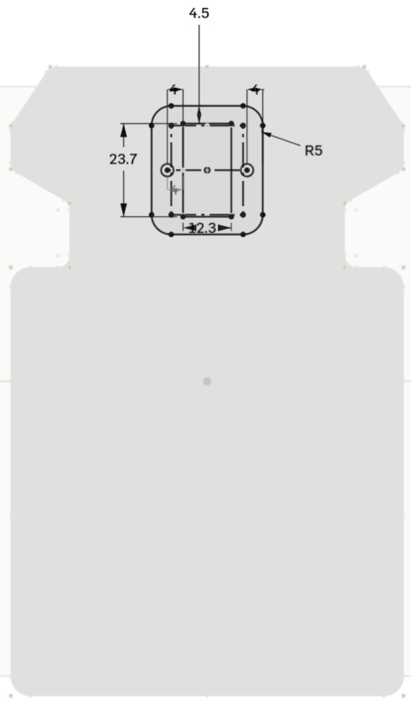
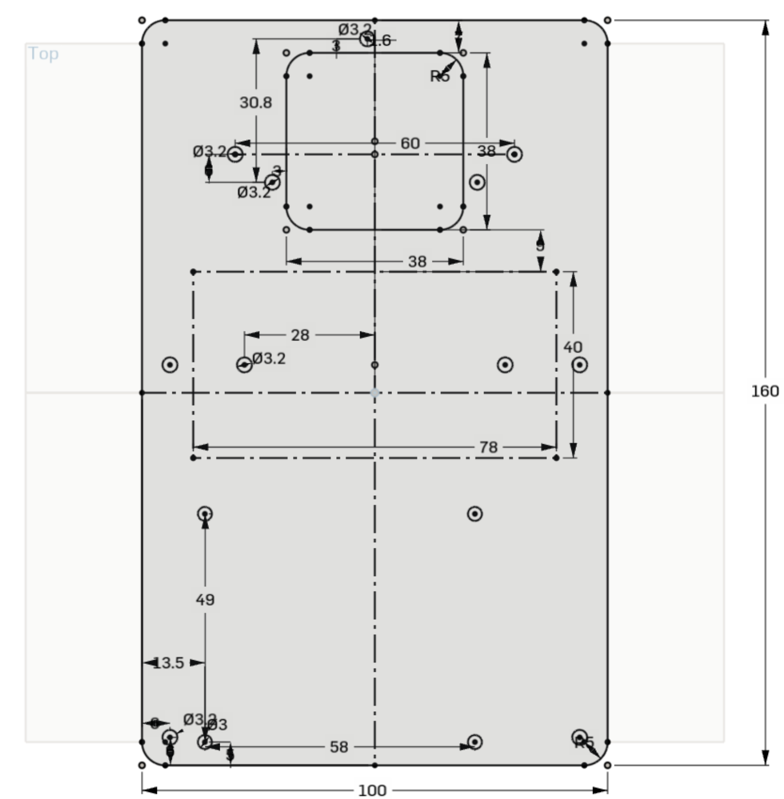
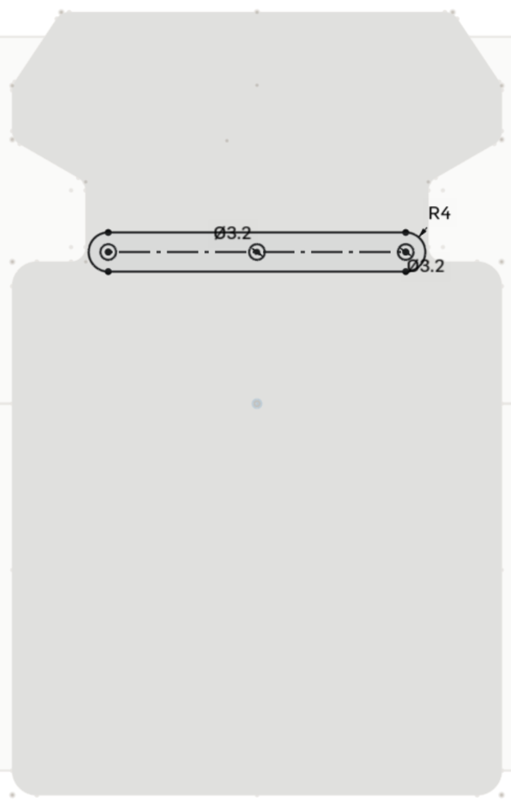
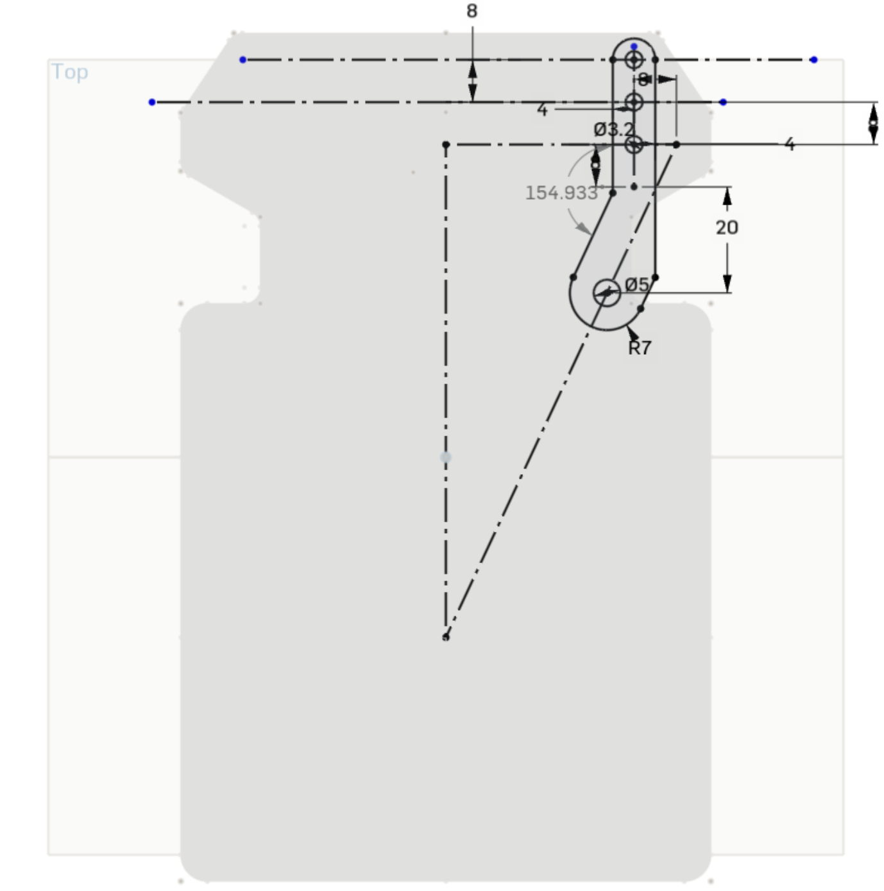
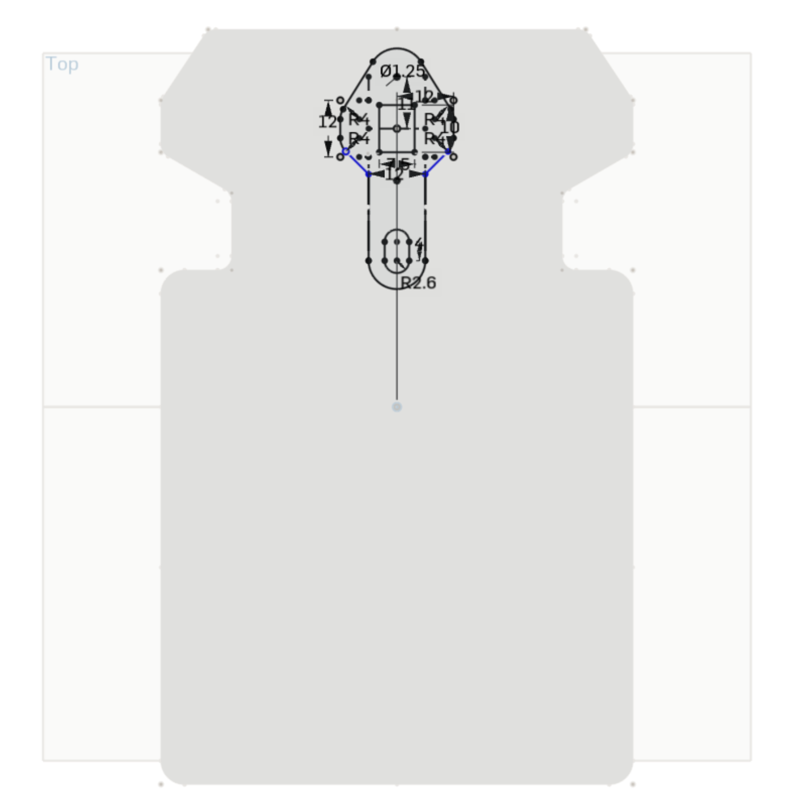
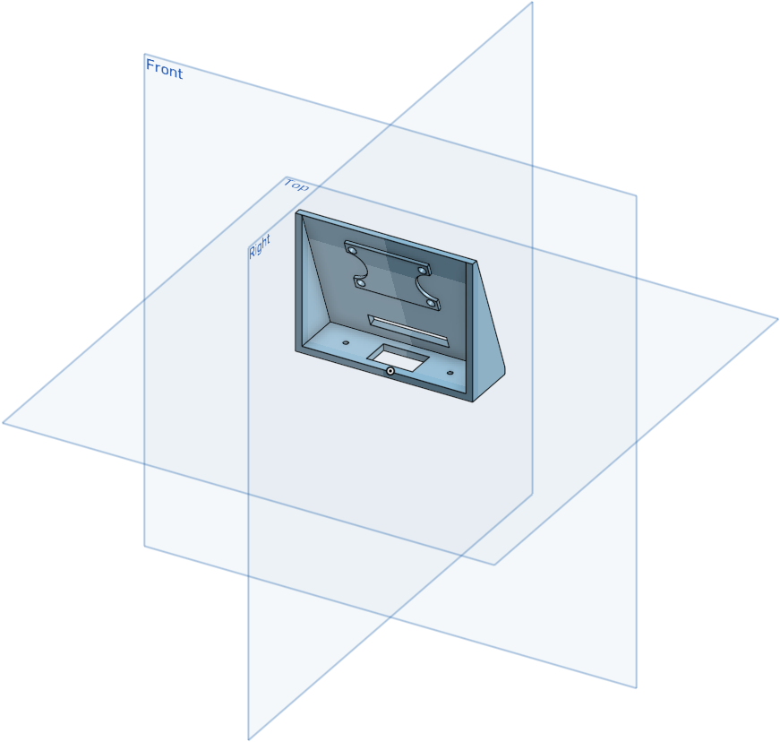
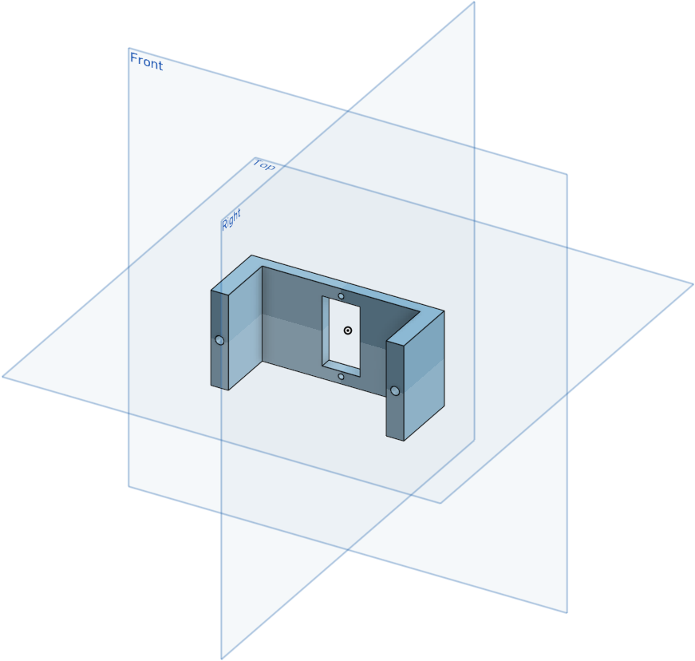
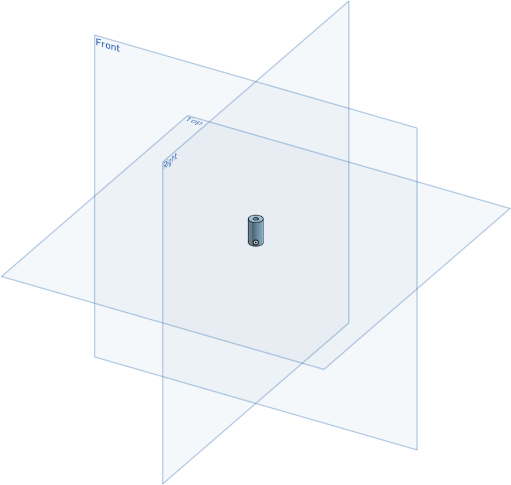

# Modelling Documentation

## The Base

As compared to last year's design, we have reduced the length significantly from 250mm to 160mm by rearranging and modifying the components to be more space efficient. The width of the base plate has also been shrunk from 134mm to 100mm. This has benefitted us greatly as the bot now has a smaller turning radius which makes its turning sharper and more responsive.

### Base Plate

We have rearranged the motor such that it is now parallel to the wheel shaft, allowing the robot to be much shorter than the previous iteration. We also had to redesign the Ackermann steering to accommodate to the change in the base length. There are also corner cuts at the front of the base so that it does not get in the way of the wheels when steering.

This part is designed to sandwich the servo against the base plate, ensuring that the servo motor is secured in position.

### Level Plate

The components on the level plate has also been arranged in a much more compact manner. The main change we have made shrinking the size of the PCB, which had a lot of empty space previously. This was done by shifting the positions of the components of the PCB, reducing the amount of unoccupied space. 

### Ackermann Steering

<table>
  <tr>
    <td></td>
    <td></td>
    <td></td>
  </tr>
</table>

<!-- , [ackermann_inverted_inside_beam](ackermann_inverted_inside_beam.png), [ackermann_steering_servo_beam](ackermann_steering_servo_beam.png) -->

The Ackermann steering mainly uses 3 parts, the steering arms, which are connected to each wheel, a servo beam, which connects to a servo motor driving the mechanismI, and a longer beam linking the steering arms and servo beam together. In order to calculate the dimensions of the Ackermann steering geometry, we sketched it out in the CAD software before laser cutting the parts, ensuring that each component was of the exact dimensions.

### Camera 

<table>
  <tr>
    <td></td>
    <td></td>
  </tr>
</table>

<!-- ,  -->

The current version of our bot features a swiveling camera, which replaces the wide-angle camera found in the previous version. Although the field of view is only 60 degrees, as compared to the 120 degrees of the wide-angle lens, the servo attached to the camera allows it to swivel and face the obstacles, mitigating the problem of not being able to see the obstacle past a certain point.

### Raspbery Pi standoff

We also 3D printed a standoff to support the PCB as it was connected to the Raspberry Pi in such a way that it would be slighty tilted without the standoff.