# Schemes
## Assembly
Our robot consists of 2 layers of components. From the 2025 competition, we continued with the idea of making use of our vertical space to mount all our components. This is achieved by splitting our robot into **different layers**. 
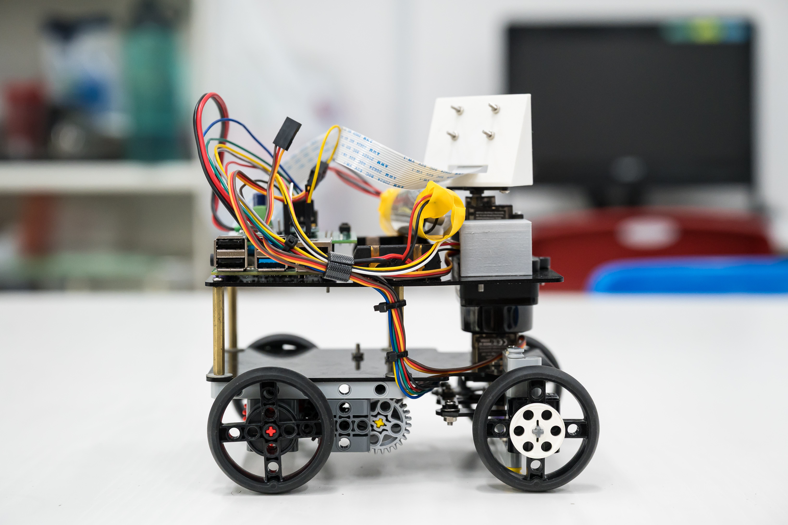

The **underface of the bottom layer** of our robot comprises of all our main drivebase components. This includes our Ackermann Steering Mechanism, and our Rear Wheel Drive mechanism, both of which are explained in more detail under the Mechanical Designs of this README file. The upperface of our bottom layer is not used.
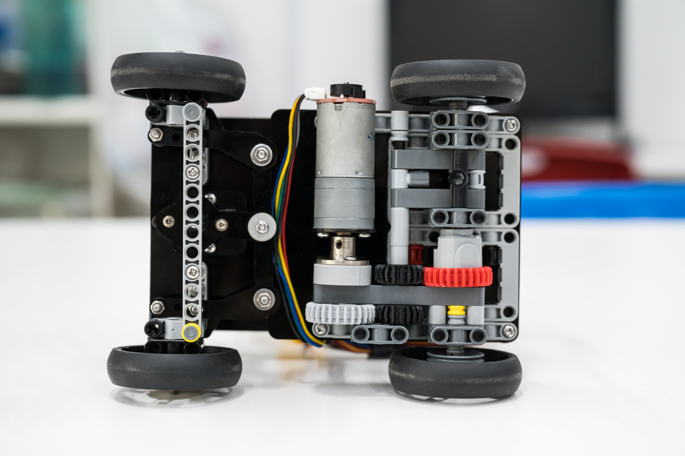

On our second/top layer, we utilise both the **underface** and the **upperface** of this layer for our robot components. 

On the **upperface**, we mounted components such as our Raspberry Pi Controller module, our PCB that is directly attached to our Raspberry Pi, a battery holder, and our rotating Camera mount. Mounting these components came with several issues, as there were several considerations when mounting each component. One of the most significant considerations we had to take into account was the importance of balancing our centre of gravity. In terms of our left-right centre of gravity, our drivebase motor on the bottom layer is mounted with a slight offset to the left. As such, we had to mount the components on our top layer to cancel out this offset. 
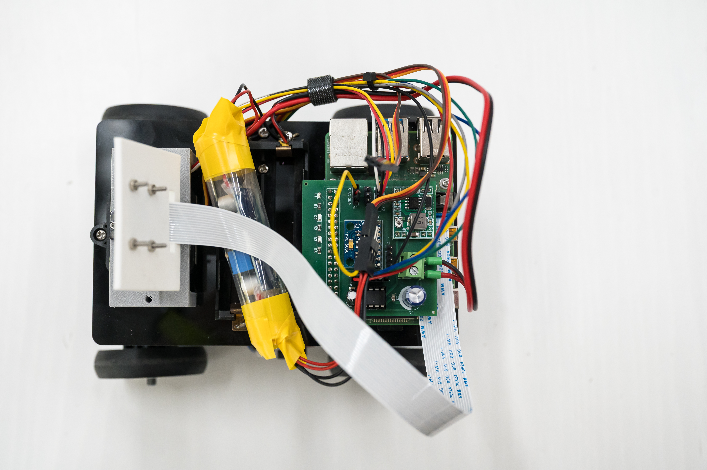

On the **underface of our second/top layer**, is where we mounted our Coin-D4 LiDar sensor. This is because both our layers are connected together by a long standoff, creating a large amount of empty space between both layers that allows the LiDar to capture the most readings. In this way, the only slight blindspots for our LiDar would be in the location and direction of the 4 standoffs connecting the two layers of our robot together. However, these blindspots are insignificant and almost negligible. In addition, with these standoffs in place, it acts as a pillar where we can fasten our long and stray wires to, so as to prevent the wires from being an obstruction to our LiDar and influencing our readings. In particular, the wires from the motor of our drivebase had to be routed upwards to connect to the PCB on the top layer of our robot. 
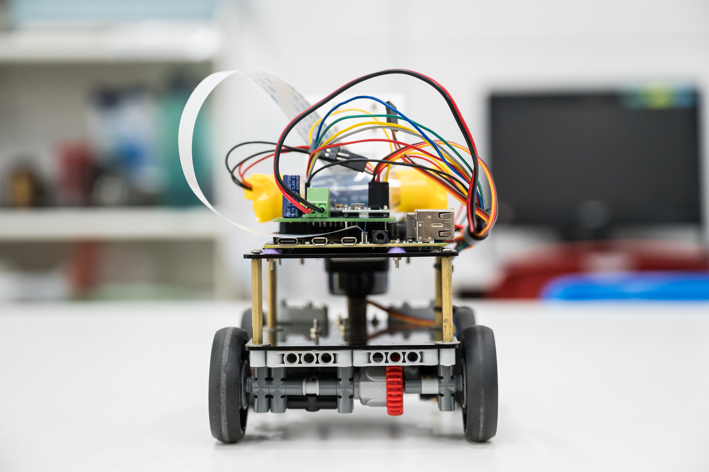

## Sensors
### Lidar
A **Lidar sensor** uses laser beams and speed of light to measure the distance in front of the sensor, and is useful for 2D mapping, as it provides accurate readings/measurements from any angle. The model of the Lidar sensor we are using is the **COIN-D4**, a compact, 360-degree coaxial laser scanner developed by Guoke Optical Core. It provides high-frequency distance measuring between 0.05 to 12 meters. 

### IMU (Gyro)
a **Gyro** allows us to measure rotation around different axes(x, y and z), allowing us to find our direction of rotation and rotation angle for our robot. By using a gyro, we can be more reliable and accurate at measuring rotation over a short period of run time. The Gyro component we are using is the **MPU-6050**, a 6-axis Inertial Measurement Unit (IMU), that combines a 3-axis gyroscope to measure rotational speed or twist, and a 3-axis accelerometer to measure gravity and linear acceleration. The built in I2C protocol allows us to communicate with this IMU sensor through our Raspberry Pi microcontroller. 
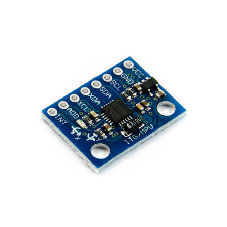

### Motor Encoder
A **motor encoder** is a sensor that tracks a motor shaft's rotation and converts it into electrical signals for our Raspberry Pi. Its main purpose is to provide real-time feedback on position, speed, and direction of our drive motor. The Motor Encoder we have used for our robot is an **AB Hall-effect Encoder**, which is a type of quadrature encoder that measures rotation using the strength of the magnetic field in the x and y direction, and measures the positive/negative magnetic charge in those directions. 
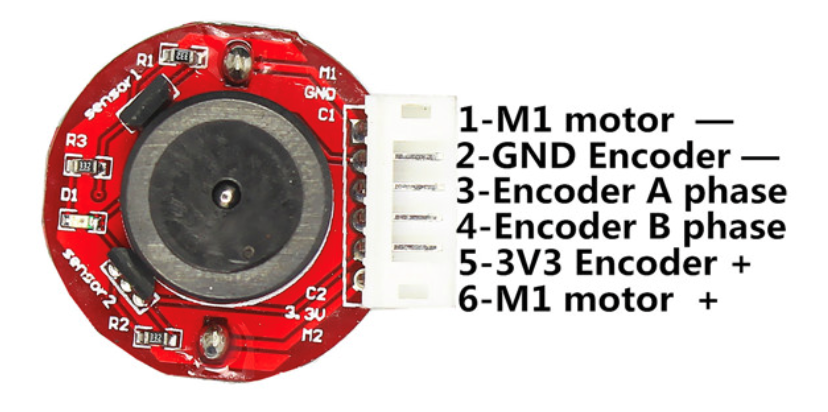

### Motor Driver
A **motor driver** serves to regulate, direct, and coordinate the electrical energy supplied to our motor. The motor driver we have implemented on our robot is the **TA6586**, a monolithic, bidirectional H-bridge motor driver IC that uses sign-magnitude drive. In sign-magnitude control, the sign determines the motor's direction, while the magnitude determines how strongly the motor is driven. 

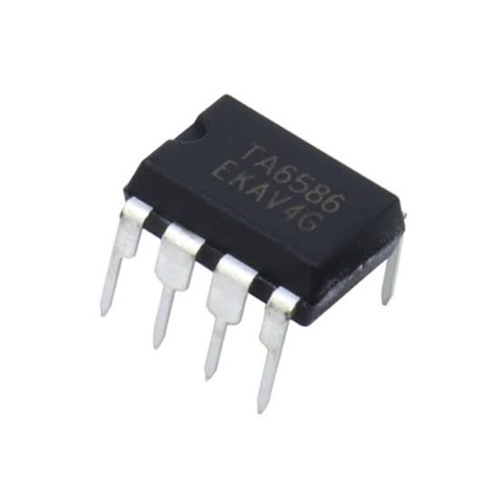

### Camera
The **camera** lets us capture real-time footage of the Future Engineer Field while the robot is moving. This camera mainly serves to detect the red and green obstacles, allowing our robot to make the appropriate movement adjustments accordingly. The camera we have used for our robot is the **Raspberry Pi Camera Module v2**, an official 8-megapixel small add-on board with a Sony IMX219 CMOS image sensor, designed to plug directly into the CSI port of our Raspberry Pi.
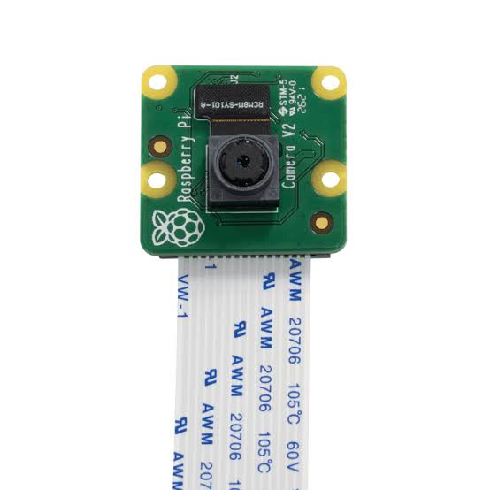

## 3D Printed Parts
For every component that we wanted to design ourselves, we went through the same process for every part. We firstly had to figure out the functionality of said component, followed by the restrictions for the part, including size limitations, surrounding components, etc, before figuring out and taking suitable measurements for the mounting location of the part. 

To see the full designing process of each 3D printed component of our robot, please refer to the README file document in our models folder. 

## Mechanical Designs

### Drive Module
For the driving of our robot, we used a **Rear-Wheel-Drive (RWD) structure**. This structure consists of one motor, driving a central shaft that is linked to the main Differential gear, that drives two shafts on either ends of the gearbox as the outputs. Our wheels are then mounted on both shafts. For our robot in particular, our RWD structure is more unique. Our motor that drives the gearbox is not linked directly to the shaft, but mounted sideways instead to save space. By linking the motor shaft to the gearbox through gears on the side, it allows our RWD to achieve the same results, while reducing the size of our drivebase. 
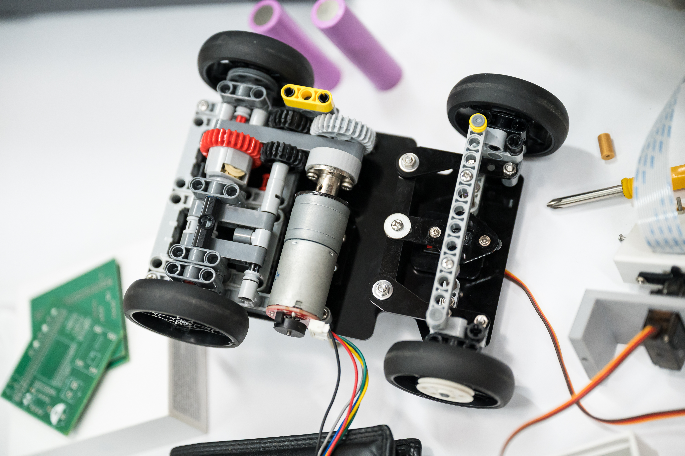

### Steering
For our steering, we referenced the popular **Ackermann Steering geometry**, that is often used in cars, vehicles etc. The Ackermann Steering geometry consists of a system of linkages on a vehicle's steering that makes the inner front wheel turn at a sharper angle than the outer front wheel in a turn, so that both steering wheels point to a common turning center. This is achieved by designing a custom Ackermann Steering linkage that connects our steering servo motor to our wheel components. To see the full designing process of this Ackermann linkage, do refer to the README file in our models folder.
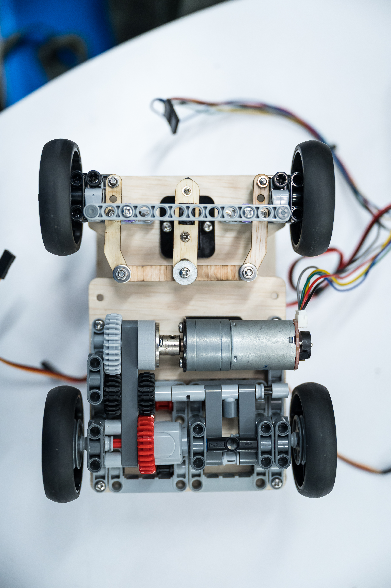

### Camera Rotation
In the 2025 Future Engineers competition, our camera often failed to detect obstacles near the edge of the camera's POV. As such, we wanted to improve our camera mount, instead of just being a fixed stationery mount, to be able to **rotate** and check for obstacles from **different angles** quickly. This mechanism was fairly straightforward and simple, as it merely required us to mount the camera on a servo motor. We achieved this by designing a custom elevation bracket with a rectangular slot in the middle for the servo motor to lie in. This bracket allos the servo motor to sit above our LiDar sensor, a location we found most suitable for our camera. Thereafter, we mounted our Camera bracket to the servo motor, allowing our camera to then rotate within a range of 180 degrees. 

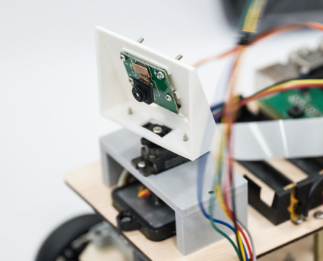
