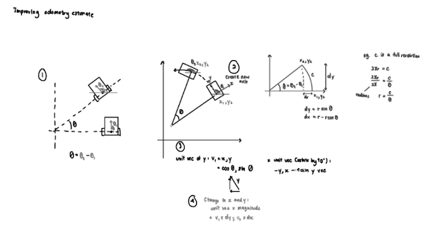

# Software Documentation 

## Overall programme 

### Open Strategy 

We adopted a safer strategy for the open challenge by keeping the robot as close to the centre of the lanes as possible. By default, it would take the outermost path, 50 cm away from the outer wall. However, if the lidar detects that the first section of the inner wall is extended, the lane will shift closer to the wall such that it is 30 cm away from the outer wall. 

During the initialisation, the robot will assume it is moving clockwise until it reaches the corner: this is where the robot will read the distances from lidar sensor for the points (0mm, 2700mm) and (1000mm, 2700mm). If the distance for the left point is greater than the right point, it will deduce that it is moving counterclockwise and update its pose accordingly. The reason why we chose these points instead of measuring the left and right distances is because we encountered trouble with the CoinD4 lidar in getting distances close to 3000mm. 

**Pseudocode** 
initialise_hardware (initialise_hardware.py)
	gyro 
	lidar 
	encoder
	motors

wait for button press

find initial position (initialise_pos.py)
	read lidar 
	calculate initial pos

intialise_telemetry (telemetry.py)
	initialise network connection 

first path while True:
	If width is 1000, take path with x = 500
	elif width is 600, take path with x = 300
	check while moving
	if east > some dist:
		confirm pose
		break
	elif west > some dist:
		confirm pose
		break

main while True:
	read sensors (sensors.py)
		gyro 
		lidar 
		encoder

	estimate position -- odometry using encoder and gyro (odometry.py)
	localise - lidar (spike_localisation.py, point_cloud_localisation.py) - same functions, input (estimate_pos, lidar_readings) and output (localised_pos)
	merge estimate_pos and localised_pos (filter.py)
	follow paths (navigation.py)
	if end of a path:
		check spike position to check if next wall is extended / aim at a certain point to check distance
	if at ending position:
		break 
stop

### Obstacle Strategy 

Our approach is to have two fixed sets of paths, an outer and inner lane. Depending on the colour of the blocks in front, it will switch between the two paths to follow. For example, if the robot is moving clockwise, detecting a red block will cause it to follow the inner paths, and vice versa for the green blocks. This will switch if the robot is moving counterclockwise. 

**Pseudocode**

initialise_hardware (initialise_hardware.py)
	gyro 
	lidar 
	encoder
	motors

wait for button press

find initial position (initialise_pos.py)
	read lidar 
	calculate initial pos 
		front dist > back dist (clockwise); back_dist > front_dist (CCW)
		if there are invalid readings (check with a range) 
			use only the valid reading 

intialise_telemetry (telemetry.py)
	initialise network connection 

if obstacle in front:
	move back

main while True:
	read sensors (sensors.py)
		gyro 
		lidar 
		encoder

	estimate position -- odometry using encoder and gyro (odometry.py)
	localise - lidar (spike_localisation.py, point_cloud_localisation.py) - same functions, input (estimate_pos, lidar_readings) and output (localised_pos)
	merge estimate_pos and localised_pos (filter.py)
	follow paths (navigation.py)
	if end of a path:
		check camera for obstacle
	if at ending position:
		break 

parking 

stop

## Sensor Libraries 

### LiDAR - COIN-D4 

We created our own library to receive data from the COIN-D4 LiDAR which uses the UART protocol, we used the serial package to open the serial port /dev/tty50 with the baud rate 230400.  

Everytime the input buffer is populated, we check if the first two character matches the data header '\xAA\x55' before retrieving the sample count (4th byte) so that every group of readings is fully taken before being checking the checksum and parsing it. 

Afterwards, each reading is assigned to the closest angle it was taken from. 

### Gyro - MPU-6050 

Initially, we used the smbus library, but realised it was too slow and caused significant delays, so we switched to pigpio. 

### Encoder - AB Hall-effect Encoder 

### Motor Driver - TA6586

### Camera - Raspberry Pi Camera Module v2

### Servos (Camera Swivel, Steering) - MG90

### I/O Interface (Button, LEDs)

### Compass (unused) - 

## Localisation 

### Odometry 

We use the wheel rotation and gyro to estimate the robot's pose (position and heading) while it is running. 

- steer_in_dir(): steering (proportional control) 
- augment_path(), augment_paths(): Steering back to line 
    - Find path vector = (x2-x1) / (y2-y1)
    - Find distance of path
    - Find path vector in units
    - Find perpendicular path vector
    - Find path direction 
- dot(): dot product 
    - how far robot is off the path – drive_path()
    - how far robot has traveled along the path 
- drive_path(), drive_paths():

- estimate_pose():
    - First version: looked at the heading and assumed a straight path based on the heading 

    

    - Second version: treat the movement as an arc of a circle
        - Treat the centre of rotation as the origin, which means $$\theta = \theta_{2} - \theta_{1}$$, to find the local $d_x, d_y$
        $$d_y = r sin \theta, d_x = r cos \theta$$
        - Since $r = \frac{c}{\theta}$, in which c is the distance travelled
        $$d_y = \frac{c}{\theta} sin \theta, d_x = \frac{c}{\theta} cos \theta$$
        - To apply this back to the original axis, we take the x, y vectors of the "morphed" graph, (rotate y vector by $90^o$), before we multiply the unit vectors with the local $d_x, d_y$ to find the global $d_x, d_y$
        $$y^​′=(cosθ, sinθ​)$$
        $$x^′=(−sinθ, cosθ​)​$$
        $$d_X = x^​′ \times d_x, d_Y = y^​′ \times d_y$$

## Pathfinding 

## Camera Tracking 

## Obstacle Strategy 

