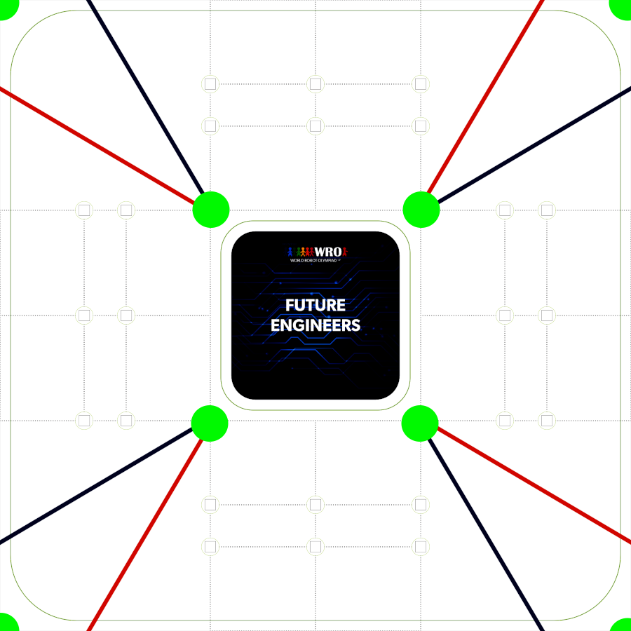
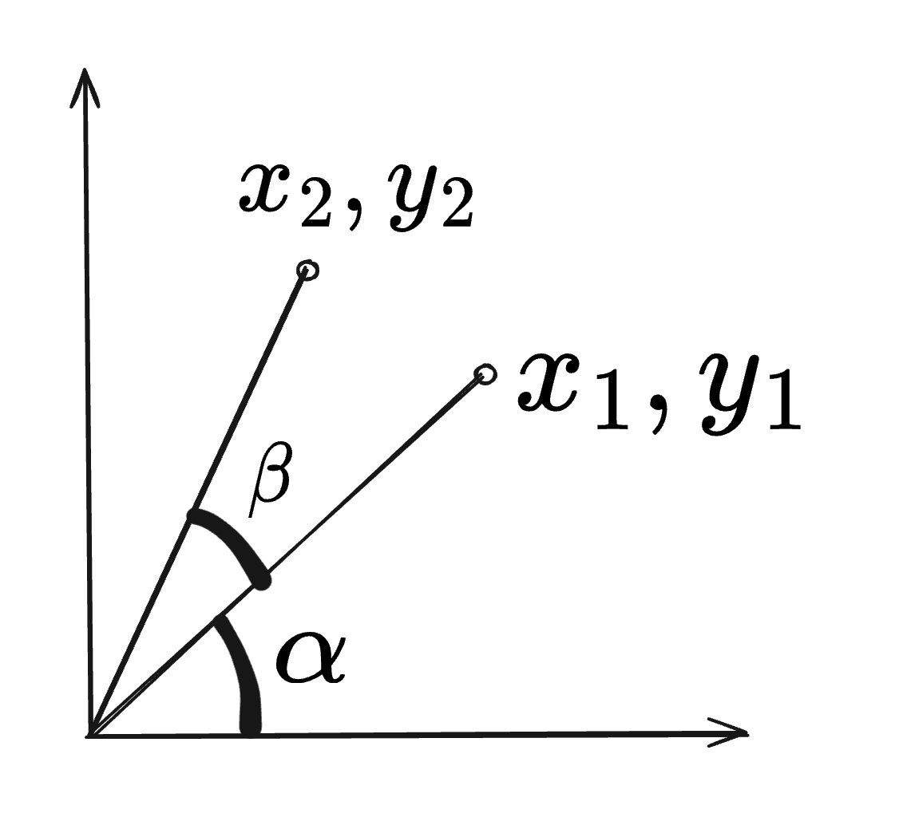
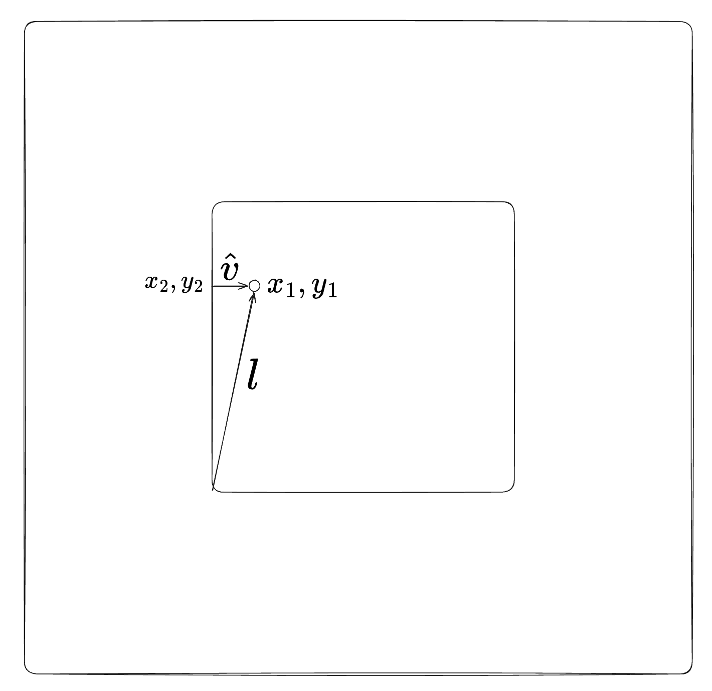
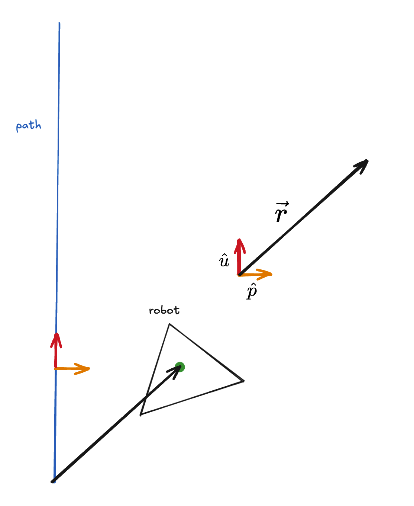

# Software Documentation 

## Overall programme 

### Open Strategy 

We adopted a safer strategy for the open challenge by keeping the robot as close to the centre of the lanes as possible. By default, it would take the outermost path, 50 cm away from the outer wall. However, if the lidar detects that the first section of the inner wall is extended, the lane will shift closer to the wall such that it is 30 cm away from the outer wall. 

During the initialisation, the robot will assume it is moving clockwise until it reaches the corner: this is where the robot will read the distances from lidar sensor for the points (0mm, 2700mm) and (1000mm, 2700mm). If the distance for the left point is greater than the right point, it will deduce that it is moving counterclockwise and update its pose accordingly. The reason why we chose these points instead of measuring the left and right distances is because we encountered trouble with the CoinD4 lidar in getting distances close to 3000mm. 

**Pseudocode** 
```
initialise_hardware (initialise_hardware.py)
	gyro 
	lidar 
	encoder
	motors

wait for button press

find initial position (initialise_pos.py)
	read lidar 
	calculate initial pos

intialise_telemetry (telemetry.py)
	initialise network connection 


first path while True:
	If width is 1000, take path with x = 500
	elif width is 600, take path with x = 300
	check while moving
	if east > some dist:
		confirm pose
		break
	elif west > some dist:
		confirm pose
		break

main while True:
	read sensors (sensors.py)
		gyro 
		lidar 
		encoder

	estimate position -- odometry using encoder and gyro (odometry.py)
	localise - lidar (spike_localisation.py, point_cloud_localisation.py) - same functions, input (estimate_pos, lidar_readings) and output (localised_pos)
	merge estimate_pos and localised_pos (filter.py)
	follow paths (navigation.py)
	if end of a path:
		check spike position to check if next wall is extended / aim at a certain point to check distance
	if at ending position:
		break 
stop
```

### Obstacle Strategy 

Our approach is to have two fixed sets of paths, an outer and inner lane. Depending on the colour of the blocks in front, it will switch between the two paths to follow. For example, if the robot is moving clockwise, detecting a red block will cause it to follow the inner paths, and vice versa for the green blocks. This will switch if the robot is moving counterclockwise. 

**Pseudocode**
```
initialise_hardware (initialise_hardware.py)
	gyro 
	lidar 
	encoder
	motors

wait for button press

find initial position (initialise_pos.py)
	read lidar 
	calculate initial pos 
		front dist > back dist (clockwise); back_dist > front_dist (CCW)
		if there are invalid readings (check with a range) 
			use only the valid reading 

intialise_telemetry (telemetry.py)
	initialise network connection 

if obstacle in front:
	move back

main while True:
	read sensors (sensors.py)
		gyro 
		lidar 
		encoder

	estimate position -- odometry using encoder and gyro (odometry.py)
	localise - lidar (spike_localisation.py, point_cloud_localisation.py) - same functions, input (estimate_pos, lidar_readings) and output (localised_pos)
	merge estimate_pos and localised_pos (filter.py)
	follow paths (navigation.py)
	if end of a path:
		check camera for obstacle
	if at ending position:
		break 

parking 

stop
```

## Sensor Libraries 

### LiDAR - COIN-D4 

We created our own library to receive data from the COIN-D4 LiDAR which uses the UART protocol, we used the serial package to open the serial port /dev/tty50 with the baud rate 230400.  

Everytime the input buffer is populated, we check if the first two character matches the data header '\xAA\x55' before retrieving the sample count (4th byte) so that every group of readings is fully taken before being checking the checksum and parsing it. 

Afterwards, each reading is assigned to the closest angle it was taken from. 

### Gyro - MPU-6050 

Initially, we used the smbus library, but realised it was too slow and caused significant delays, so we switched to pigpio. 

### Encoder - AB Hall-effect Encoder 

### Motor Driver - TA6586

### Camera - Raspberry Pi Camera Module v2

### Servos (Camera Swivel, Steering) - MG90

### I/O Interface (Button, LEDs)

### Compass (unused) 

## Localisation 

### Odometry 

We use the wheel rotation and gyro to estimate the robot's pose (position and heading) while it is running. 


- steer_in_dir(): steering (proportional control) 
- augment_path(), augment_paths(): Steering back to line 
    - Find path vector = (x2-x1) / (y2-y1)
    - Find distance of path
    - Find path vector in units
    - Find perpendicular path vector
    - Find path direction 
- dot(): dot product 
    - how far robot is off the path – drive_path()
    - how far robot has traveled along the path 
- drive_path(), drive_paths():

- estimate_pose():
    - First version: looked at the heading and assumed a straight path based on the heading 

    

    - Second version: treat the movement as an arc of a circle
        - Treat the centre of rotation as the origin, which means $$\theta = \theta_{2} - \theta_{1}$$, to find the local $d_x, d_y$
        $$d_y = r sin \theta, d_x = r cos \theta$$
        - Since $r = \frac{c}{\theta}$, in which c is the distance travelled
        $$d_y = \frac{c}{\theta} sin \theta, d_x = \frac{c}{\theta} cos \theta$$
        - To apply this back to the original axis, we take the x, y vectors of the "morphed" graph, (rotate y vector by $90^o$), before we multiply the unit vectors with the local $d_x, d_y$ to find the global $d_x, d_y$
        $$y^​′=(cosθ, sinθ​)$$
        $$x^′=(−sinθ, cosθ​)​$$
        $$d_X = x^​′ \times d_x, d_Y = y^​′ \times d_y$$

Afterwards, we integrate other localisation methods on top of using odometry, by using a complementary filter. 

### Spike Landmark 

Initially, we used the spike landmark method during the 2025 season of WRO, but we wanted to improve our localisation method so we have since shifted to the [Iterative Closest Point](#Iterative-Closest-Point) method. 

Essentially, the method matches identifies which lidar readings are spikes or points of interest, in our case corners which are noticeably further away than the adjacent readings. Afterwards, we calculate if there is any difference between the supposed and actual cartesian coordinate of the landmark to find the error. 

- Defined 8 landmarks: 4 inner corners, 4 outer corners, marked as green circles

- add_cartesian(): convert lidar readings into cartesian coordinates
- identify_spikes()  
	- the different between two lidar measurements adjacent to the centre measurement have to show a significant difference
	- filter out spikes within 250mm
- match_landmarks(): within 120mm, which we tested as the most optimal threshold 
- calc_position_error(), calc_angle_error(): according to the spikes matched, we calculate the total error accumulated for x, y and heading (angle of the spike from the robot) separeately before finding the average for each value and adding it to the odometry_pose 

However, this method only uses a few points out of the approximate 400 we get from the lidar in comparison to the [Iterative Closest Point](#Iterative-Closest-Point) method that makes full use of all the lidar readings. 

### Iterative Closest Point 

- augment_walls(): Define the 8 walls on the playfield, getting their path vector, path direction, unit path vector and perpendicular path vector which are values needed 
- add_cartesians(): same as the one used in the Spike Landmark 

**localise():**
Let's start by transforming 1 point on a cartesian plane. 



To handle the rotation, we can 

$$x_2 = R \cos(\alpha + \beta) = R [\cos(\alpha)\cos(\beta) - \sin(\alpha)\sin(\beta)]$$
$$y_2 = R \sin(\alpha + \beta) = R [\sin(\alpha)\cos(\beta) + \cos(\alpha)\sin(\beta)] $$

Substitute $$x_1 = R \cos(\alpha), y_1 = R \sin(\alpha)$$, 

$$x_2 = x_1\cos(\beta) - y_1\sin(\beta) $$
$$y_2 = y_1\cos(\beta) + x_1\sin(\beta) $$

Since the change in x, y and heading is going to small as the frequency of the Coin-D4 is 10 Hertz, we can linearize the functions, by taking their gradients near 0. 

$$ \cos(\beta) \approx 1, \sin(\beta) \approx \beta $$

$$ \therefore x_2 = x_1 - y_1(\beta), y_2 = y_1 + x_1(\beta) $$

Afterwards, we add translation as $T_x, T_y$

$$ x_2 = x_1 - y_1(\beta) + T_x, y_2 = y_1 + x_1(\beta) + T_y $$
$$ \therefore x_2 - x_1 = -y_1(\beta) + T_x, y_2 - y_1 = x_1(\beta) + T_y $$

When we put it in a matrix form, 

$$ \begin{bmatrix} 
-y_1 & 1 & 0 \\
x_1 & 0 & 1 
\end{bmatrix}
\begin{bmatrix} 
\theta \\
T_x \\
T_y
\end{bmatrix} = \begin{bmatrix} 
x_2 - x_1 \\
y_2 - y_1
\end{bmatrix}
$$

And we can add as many points as we want to the equation

$$ \begin{bmatrix} 
-y_1 & 1 & 0 \\
x_1 & 0 & 1 \\
\vdots & \vdots & \vdots
\end{bmatrix}\begin{bmatrix} 
\theta \\
T_x \\
T_y
\end{bmatrix} = \begin{bmatrix} 
x_2 - x_1 \\
y_2 - y_1 \\
\vdots
\end{bmatrix}
$$ 

To solve this $Ax = B$, we take the psuedoinverse of A multipled by B, $x = A^{-1} B$ which we calculate using the `numpy` library. 

Now that we have the transformation matrix, we need to identify which point on the wall does the lidar reading correspond to, in our case we find the shortest perpendicular distance between each wall and the reading. 



$dist = \hat{v} \cdot l$, in which $l$, is the vector of the lidar reading from the start of the wall. If it is a vertical wall, we only solve for the x-value and vice versa for a horizontal wall. 

**localise_iter():**
Since we are dealing with an overdetermined system, there is no exact solution, but only a rough estimate. Running it with more iterations will help minimise the errors. 

We tested it with a set of fake data which started with the mini-sets contain that have far fewer readings, before moving on to [set 1](/point_cloud_test_sets/set1.txt) which has 360 points, closer to what we will expect in the acutal run. After debugging, we realised that it was able to get close to the actual pose with only one iteration. Additionally, we timed it and it took roughly $\frac{1}{50}$th of a second, meaning it is able to keep up with the lidar which takes 10 readings every 1 second. 

## Pathfinding 



- drive_path(), drive_paths(): 
	- Find the error by taking the dot product of the unit vector perpendicular to the path and the vector from the start of the path to the robot (robot_vector): perpendicular displacement $= \hat{u} \cdot \vec{r} $
	- Get the correction / perpendicular distance of the robot from the path by multiplying the error by a gain
	- Add the target_dir of the path with the correction which is what the robot will steer towards 
	- Keep checking the dist_travelled_along_path if it reaches the end by taking the dot product of the unit_path_vector and the robot vector: displacement along path $= \hat{p} \cdot \vec{r} $

Thus, the robot is able to slowly adjust itself towards the path. 

## Camera Tracking 

## Debugging / Telemetry tools 


