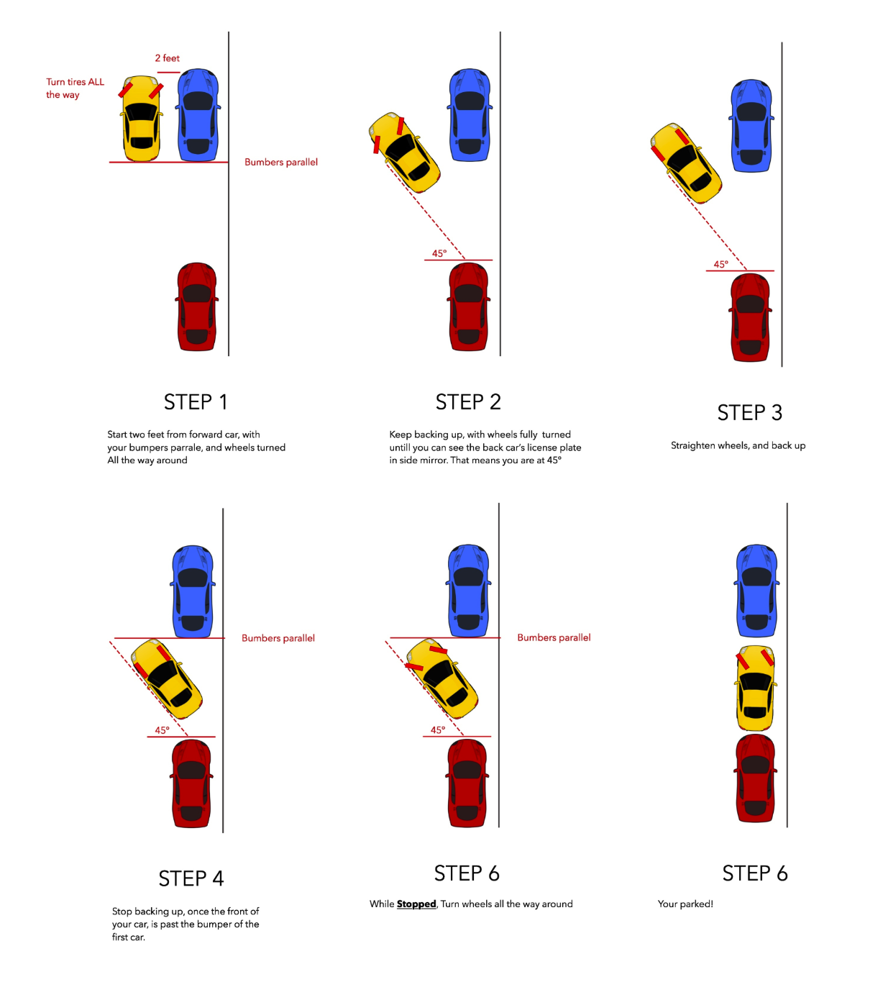
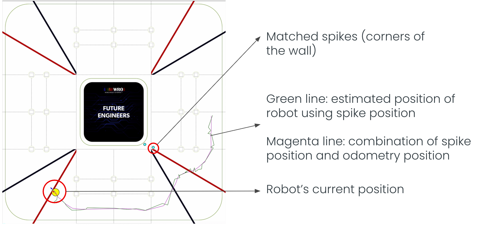

# Software Documentation 

## General Approach (applied to both open and obstacle challenge)

1. [Odometry](#odometry): Estimating pose using [encoder](#encoder---ab-hall-effect-encoder) and [gyro](#gyro---mpu-6050)
2. [Localisation](#localisation) using LiDAR using [Iterative Closest Points](#iterative-closest-point) (previously [Spike Landmark](#spike-landmark)) before merging both the odometry pose and localised pose using a [complementary filter](#complementary-filter)
3. [Path following](#path-following) using the new merged pose 

## Sensor Libraries 

### LiDAR - COIN-D4 

We created our own library, because there weren't any python raspberrypi libraries, to receive data from the COIN-D4 LiDAR which uses the UART protocol. To create it, we used the serial package to open the serial port /dev/ttyS0 with the baud rate 230400.  

Everytime the input buffer is populated, we check if the first two character matches the data header '\xAA\x55' before retrieving the sample count (4th byte) so that every group of readings is fully taken before being checking the checksum and parsing it. The scan frequency is roughly 10 rotations per second and each frame of data points is 360 degrees.  

Afterwards, each reading is assigned to the closest angle it was taken from, by rounding the angle and taking a modulus of 360 as the index. 

### Gyro - MPU-6050 

The gyro sensor uses the i2c protocol so initially, we used the pigpio library to receive data, but realised it was too slow and caused significant delays, so we switched to smbus. 

Additionally, we had to numerical integrate the z-axis gyroscope data over time to calculate the heading:
1. Read the raw angular velocity
2. Subtract the calibrated gyro offset value
3. Calculate the time passed since the previous reading
4. Take the sum of the current and previous z readings, multiply it by the time passed, and divide it by the sensitivity scale factor (131 * 2)

To find the calibrated gyro offset value, we also created a calibration function so that when we leave the robot as stationary, we can take the average of 500 measurements (which are suppose to be zero values) to find the z error. We also created functions to save the calibration as a txt file and load it. 

### Encoder - AB Hall-effect Encoder 

It is a type of quadrature encoder that measures rotation using the strength of the magnetic field in the x and y direction, and measures the positive/negative magnetic charge in those directionn. The true mechanical angle is then recovered by applying arctangent because the rotating magnet produces orthogonal sine and cosine magnetic field components. 

We used the pigpio library and programmed two callback functions to detect change in states for each channel A (Pin 5) and B (Pin 6)

```python 
cb1 = pi.callback(5, pigpio.RISING_EDGE, self.step_count)
cb2 = pi.callback(6, pigpio.EITHER_EDGE, self.drive_dir)
```

In the first callback, when channel A rises, it checks the state of channel B. If B is high, it is moving backward, whereas if B is low, it is moving in the opposite direction, forward. The second callback is constantly updating the state of channel B. 


Encoder calibration:
2025
1st attempt
- 1522.4mm – 5113 steps, 0.298mm  – 1 step 
2nd attempt
- 4670 mm – 15795 steps, 0.296mm – 1 step

2026
| Actual | Encoder | Time | Notes     |
| -----: | ------: | ---: | --------- |
|   1285 |    2705 |  5 s |           |
|   2005 |    4370 |  8 s | Discarded |
|   2075 |    4365 |  8 s |           |
|   2070 |    4357 |  8 s |           |

### Motor Driver - TA6586

The TA6586 is a monolithic, bidirectional H-bridge motor driver IC that uses sign-magnitude drive. In sign-magnitude control, the sign determines the motor's direction, while the magnitude determines how strongly the motor is driven. In the library, the sign of the speed argument selects the direction of rotation, while the absolute value of speed determines the PWM duty cycle and by extension the motor speed.

For positive speed, the GPIO pins 20, 21 are configured as such
```python
self.pi.set_PWM_dutycycle(21, 255-speed) # PWM controlled
self.pi.set_PWM_dutycycle(20, 255) # constantly high 
```
vice versa for negative speed
```python
self.pi.set_PWM_dutycycle(21, 255) # constantly high 
self.pi.set_PWM_dutycycle(20, 255+speed) # PWM controlled 
```

This allows for lower switching losses because fewer transistors switch simultaneously 

### Camera - Raspberry Pi Camera Module v2

### Servos (Camera Swivel, Steering) - MG90

To calibrate the servos, we tested with different values from 500 to 2500 microseconds (µs) to find the centre, maximum and minimum. 

| Servo | Centre | Max, Min (in degrees) | 
| -----: | ------: | ---: | 
|   Camera |    1475 |  87 |
|   Steering |    1425 |  42 |

### I/O Interface (Button, LEDs)

In total, we have a button to start and stop the programme and three LEDS (red, yellow, green) to signal different messages for different challenges: open (red -- stationary, green -- running), obstacle (yellow -- stationary, green -- sees green obstacle, red -- sees red obstacle). 

## Localisation 

### Odometry 

We use the wheel rotation and gyro to estimate the robot's pose (position and heading) while it is running. 


- steer_in_dir(): steering (proportional control) 
- augment_path(), augment_paths(): Steering back to line 
    - Find path vector = (x2-x1) / (y2-y1)
    - Find distance of path
    - Find path vector in units
    - Find perpendicular path vector
    - Find path direction 
- dot(): dot product 
    - how far robot is off the path – drive_path()
    - how far robot has traveled along the path 
- drive_path(), drive_paths():

- estimate_pose():
    - First version: looked at the heading and assumed a straight path based on the heading 

    

    - Second version: treat the movement as an arc of a circle
        - Treat the centre of rotation as the origin, which means $\theta = \theta_{2} - \theta_{1}$, to find the local $d_x, d_y$
        $$d_y = r sin \theta, d_x = r cos \theta$$
        - Since $r = \frac{c}{\theta}$, in which c is the distance travelled
        $$d_y = \frac{c}{\theta} sin \theta, d_x = \frac{c}{\theta} cos \theta$$
        - To apply this back to the original axis, we take the x, y vectors of the "morphed" graph, (rotate y vector by $90^o$), before we multiply the unit vectors with the local $d_x, d_y$ to find the global $d_x, d_y$
        $$y^​′=(cosθ, sinθ​)$$
        $$x^′=(−sinθ, cosθ​)​$$
        $$d_X = x^​′ \times d_x, d_Y = y^​′ \times d_y$$

Afterwards, we integrate other localisation methods on top of using odometry, by using a complementary filter. 

### Spike Landmark 

Initially, we used the spike landmark method during the 2025 season of WRO, but we wanted to improve our localisation method so we have since shifted to the [Iterative Closest Point](#Iterative-Closest-Point) method. 

Essentially, the method matches identifies which lidar readings are spikes or points of interest, in our case corners which are noticeably further away than the adjacent readings. Afterwards, we calculate if there is any difference between the supposed and actual cartesian coordinate of the landmark to find the error. 

- Defined 8 landmarks: 4 inner corners, 4 outer corners, marked as green circles

- add_cartesian(): convert lidar readings into cartesian coordinates
- identify_spikes()  
	- the different between two lidar measurements adjacent to the centre measurement have to show a significant difference
	- filter out spikes within 250mm
- match_landmarks(): within 120mm, which we tested as the most optimal threshold 
- calc_position_error(), calc_angle_error(): according to the spikes matched, we calculate the total error accumulated for x, y and heading (angle of the spike from the robot) separeately before finding the average for each value and adding it to the odometry_pose 

However, this method only uses a few points out of the approximate 400 we get from the lidar in comparison to the [Iterative Closest Point](#Iterative-Closest-Point) method that makes full use of all the lidar readings. 

### Iterative Closest Point 

- augment_walls(): Define the 8 walls on the playfield, getting their path vector, path direction, unit path vector and perpendicular path vector which are values needed 
- add_cartesians(): same as the one used in the Spike Landmark 

**localise():**
Let's start by transforming 1 point on a cartesian plane. 


To handle the rotation, we can 

$$x_2 = R \cos(\alpha + \beta) = R [\cos(\alpha)\cos(\beta) - \sin(\alpha)\sin(\beta)]$$
$$y_2 = R \sin(\alpha + \beta) = R [\sin(\alpha)\cos(\beta) + \cos(\alpha)\sin(\beta)] $$

Substitute $$x_1 = R \cos(\alpha), y_1 = R \sin(\alpha)$$, 

$$x_2 = x_1\cos(\beta) - y_1\sin(\beta) $$
$$y_2 = y_1\cos(\beta) + x_1\sin(\beta) $$

Since the change in x, y and heading is going to small as the frequency of the Coin-D4 is 10 Hertz, we can linearize the functions, by taking their gradients near 0. 

$$ \cos(\beta) \approx 1, \sin(\beta) \approx \beta $$

$$ \therefore x_2 = x_1 - y_1(\beta), y_2 = y_1 + x_1(\beta) $$

Afterwards, we add translation as $T_x, T_y$

$$ x_2 = x_1 - y_1(\beta) + T_x, y_2 = y_1 + x_1(\beta) + T_y $$
$$ \therefore x_2 - x_1 = -y_1(\beta) + T_x, y_2 - y_1 = x_1(\beta) + T_y $$

When we put it in a matrix form, 

$$ \begin{bmatrix} 
-y_1 & 1 & 0 \\
x_1 & 0 & 1 
\end{bmatrix}
\begin{bmatrix} 
\theta \\
T_x \\
T_y
\end{bmatrix} = \begin{bmatrix} 
x_2 - x_1 \\
y_2 - y_1
\end{bmatrix}
$$

And we can add as many points as we want to the equation

$$ \begin{bmatrix} 
-y_1 & 1 & 0 \\
x_1 & 0 & 1 \\
\vdots & \vdots & \vdots
\end{bmatrix}\begin{bmatrix} 
\theta \\
T_x \\
T_y
\end{bmatrix} = \begin{bmatrix} 
x_2 - x_1 \\
y_2 - y_1 \\
\vdots
\end{bmatrix}
$$ 

To solve this $Ax = B$, we take the psuedoinverse of A multipled by B, $x = A^{-1} B$ which we calculate using the `numpy` library. 

Now that we have the transformation matrix, we need to identify which point on the wall does the lidar reading correspond to, in our case we find the shortest perpendicular distance between each wall and the reading. 


$dist = \hat{v} \cdot l$, in which $l$, is the vector of the lidar reading from the start of the wall. If it is a vertical wall, we only solve for the x-value and vice versa for a horizontal wall. 

**localise_iter():**
Since we are dealing with an overdetermined system, there is no exact solution, but only a rough estimate. Running it with more iterations will help minimise the errors. 

We tested it with a set of fake data which started with the mini-sets contain that have far fewer readings, before moving on to [set 1](/point_cloud_test_sets/set1.txt) which has 360 points, closer to what we will expect in the acutal run. After debugging, we realised that it was able to get close to the actual pose with only one iteration. Additionally, we timed it and it took roughly $\frac{1}{50}$th of a second, meaning it is able to keep up with the lidar which takes 10 readings every 1 second. 

### Complementary Filter

We set very small values for the localisation pose because we found that the odoemetry pose was already quite accurate. 
```
POSITION_FILTER_RATIO = 0.1 
HEADING_FILTER_RATIO = 0.01 
```

## Path following 


- drive_path(), drive_paths(): 
	- Find the error by taking the dot product of the unit vector perpendicular to the path and the vector from the start of the path to the robot (robot_vector): perpendicular displacement $= \hat{u} \cdot \vec{r} $
	- Get the correction / perpendicular distance of the robot from the path by multiplying the error by a gain
	- Add the target_dir of the path with the correction which is what the robot will steer towards 
	- Keep checking the dist_travelled_along_path if it reaches the end by taking the dot product of the unit_path_vector and the robot vector: displacement along path $= \hat{p} \cdot \vec{r} $

Thus, the robot is able to slowly adjust itself towards the path. 

## Camera Tracking 

### Open Strategy 

During the initialisation, the robot will assume it is moving clockwise and travel the first path until it reaches the corner: this is where the robot will read the distances from lidar sensor for the points (0mm, 2700mm) and (1000mm, 2700mm). If the distance for the left point is greater than the right point, it will deduce that it is moving counterclockwise and update its pose accordingly. The reason why we chose these points instead of measuring the left and right distances is because we encountered some issues with determining the sides at certain start positions.

In the rest of the run, the robot will followed a preplanned clockwise and counterclockwise path, whihc is as close to the centre of the lanes as possible. By default, it would take the outermost path, 50 cm away from the outer wall. However, if the lidar detects that the first section of the inner wall is extended, the lane will shift closer to the wall such that it is 30 cm away from the outer wall. 

We plan on improving our strategy by adjusting the paths to the inner paths where possible. 


**Pseudocode** 

>find initial position 
>first path run to confirm pose
>main run:
>> (process described in [general approach](#general-approach-applied-to-both-open-and-obstacle-challenge))
>> if at ending position:
>>> stop 


### Obstacle Strategy 

The robot will determine its direction (clockwise or counterclockwise) by getting the front, rear and side distances because the initial position generally fixed. It will check if an obstacle is in front of it before moving back. 

In main run, the robot will switch between two fixed sets of paths, an outer and inner lane. Depending on the colour of the blocks in front, it will switch between the two paths to follow. For example, if the robot is moving clockwise, detecting a red block will cause it to follow the inner paths, and vice versa for the green blocks. This will switch if the robot is moving counterclockwise. An improvement we made since 2025 is that we implemented [camera tracking](#camera-tracking) such that the camera follows the colour of the obstacle two sections ahead which ensures that the robot never misses the obstacle. In 2025, a major issue we had is that because our robot was larger and the field of vision of the robot was wider, we had to keep readjusting our paths so that the robot would not miss the obstacles, especially at the corners. 

As of 25th August, the parking programme is still unfinished, but our strategy is to get into the exact position at the start of parking by moving the robot back and forth. As for the parallel parking procedure, it involves 

*(Scenario in which the parking area is on the right)*
- Turn right to 45, move back till vehicle is facing 45
- Turn left to 0, move back till vehicle is behind the barrier 
- Turn left to 45, move back tile vehicle is facing 0 

Reference image:


**Pseudocode**

>find initial position
>if obstacle in front: move back 
>main run:
>> (process described in [general approach](#general-approach-applied-to-both-open-and-obstacle-challenge))
>> if at ending position:
>>> parking


## Debugging / Telemetry tools 

To make it easier to visualise the different variables — robot pose, lidar readings, matched spikes, colour of block detected - we created a telemetry software, using sockets to transfer data from the raspberrypi (client) to a computer (server) with our own protocol. We also kep the messages short so that it all fits in one packet and is not sent too frequently. Afterwards, we used tkinter to draw out the points on the playfield with the exact values written out at the left side of the interface. 




Additionally, we changed our intialiser.sh file for easier debugging. Now, every time we run, the programme will log the standard output and error messages to a file with the date and time. To change the mode of the robot (sleep, open, obstacle), we will create a softlink between main_obstacle/open/sleep.py to main.py. 
